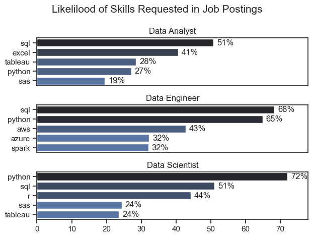

# The Analysis

## 1. What are the most demanded skills for the top 3 most popular data roles?

To find the most demanded skills for the top 3 most popular data roles. I filtered out those positoins by which one were the most popular, and got the top 5 skills for these three top roles. This query hilights the most popular job titles and their top skills, showing which skills I should pay attention to depending on the role I'm targetting. 

View my notebook with detailed steps here:
[2_demand.skill.ipynb](Actual_project/2_demand_skill.ipynb)

## Visualise Data
```Python
fig, ax = plt.subplots(len(job_titles),1)

for i, job_title in enumerate(job_titles):
    df_plot = df_skills_per[df_skills_per["job_title_short"] == job_title].head()

    sns.barplot(data=df_plot, x="skills_perc", y="job_skills", ax=ax[i], hue="skill_count", palette="dark:b_r")
```

## Results

