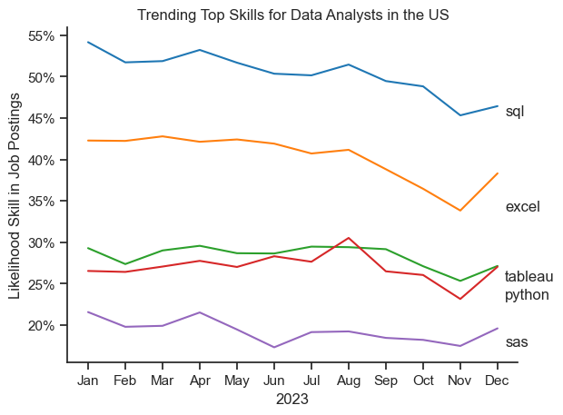
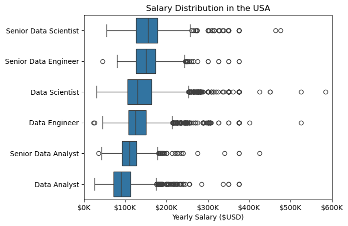
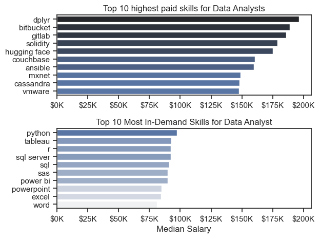
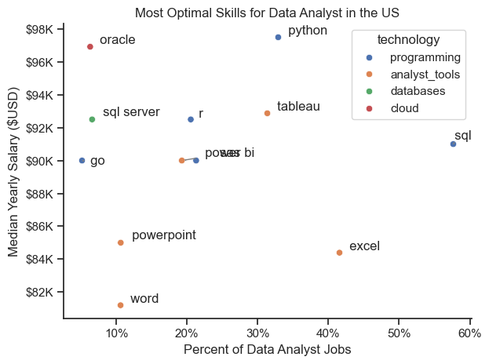

# Overview

Welcome to my analysis of the data job market, focusing on data analyst roles. This project was created out of a desire to navigate and understand the job market more effectively. It delves into the top-paying and in-demand skills to help find optimal job opportunities for data analysts.

The data sourced from [Luke Barousse's Python Course](https://lukebarousse.com/python) which provides a foundation for my analysis, containing detailed information on job titles, salaries, locations, and essential skills. Through a series of Python scripts, I explore key questions such as the most demanded skills, salary trends, and the intersection of demand and salary in data analytics.

# The Questions

Below are the questions I want to answer in my project:

1. What are the skills most in demand for the top 3 most popular data roles?
2. How are in-demand skills trending for Data Analysts?
3. How well do jobs and skills pay for Data Analysts?
4. What are the optimal skills for data analysts to learn? (High Demand AND High Paying) 

# Tools I Used

For my deep dive into the data analyst job market, I harnessed the power of several key tools:

- **Python:** The backbone of my analysis, allowing me to analyse the data and find critical insights.I also used the following Python libraries:
    - **Pandas Library:** This was used to analyse the data. 
    - **Matplotlib Library:** I visualised the data.
    - **Seaborn Library:** Helped me create more advanced visuals. 
- **Jupyter Notebooks:** The tool I used to run my Python scripts which let me easily include my notes and analysis.
- **Visual Studio Code:** My go-to for executing my Python scripts.
- **Git & GitHub:** Essential for version control and sharing my Python code and analysis, ensuring collaboration and project tracking.

# Data Preparation and Cleanup
```python
# Importing Libraries
import ast
import pandas as pd
import seaborn as sns
from datasets import load_dataset
import matplotlib.pyplot as plt  

# Loading Data
dataset = load_dataset('lukebarousse/data_jobs')
df = dataset['train'].to_pandas()

# Data Cleanup
df['job_posted_date'] = pd.to_datetime(df['job_posted_date'])
df['job_skills'] = df['job_skills'].apply(lambda x: ast.literal_eval(x) if pd.notna(x) else x)
```

# The Analysis

## 1. What are the most demanded skills for the most popular data roles?

To find the most demanded skills for the top 3 most popular data roles. I filtered out those positoins by which one were the most popular, and got the top 5 skills for these three top roles. This query hilights the most popular job titles and their top skills, showing which skills I should pay attention to depending on the role I'm targetting. 

View my notebook with detailed steps here:
[2_demand.skill.ipynb](Actual_project/2_demand_skill.ipynb)

## Visualise Data
```Python
fig, ax = plt.subplots(len(job_titles),1)

for i, job_title in enumerate(job_titles):
    df_plot = df_skills_per[df_skills_per["job_title_short"] == job_title].head()

    sns.barplot(data=df_plot, x="skills_perc", y="job_skills", ax=ax[i], hue="skill_count", palette="dark:b_r")
```

## Results


## Insights

- Python is a versatile skill, highly demanded across all three roles, but most prominently across Data Scientist (72%) and data Engineers (65%).
- SQL is the most requested skill for Data Analyst and Data Scientists, with in in over half the job postings for both roles. For Data engineers, SQL is the most sought-after skill, appearing in 68% of the postings.
- Data Engineers require more specialised technical skills (AWS, Azure, Spark) compared to Data Analyst and Data Scientists who are expected to be more proficient in more general data managment and analysis tools (Excel, Tableau). 

## 2. How are in-demand skills trending for data analysts?

## Visualise Data

```Python 
from matplotlib.ticker import PercentFormatter

df_plot = df_DA_US_percent.iloc[:,:5]
sns.lineplot(data=df_plot, dashes=False, palette="tab10")

for i in range(5):
    plt.text(11.2, df_plot.iloc[-2,i], df_plot.columns[i])

ax = plt.gca()
ax.yaxis.set_major_formatter(PercentFormatter(decimals=0))
```



## Insights

- SQL remained the most consistently demanded skill thoughout the year, although it shows a gradual decrease in demand.
- Tableau and Python seem relatively stable, througthout the year.

## 3. How well do jobs and skills pay for data analysts?

### Salary Analysis for Data Jobs



### Insights
- Data Scientists/Engineers are generally paid more than Data Analysts(inclusing Senior Data Analysts).
- Senior roles earn more than normal roles for respective positions. However not in general.

### Highest Paid Skills for Data Analysis 

#### Visualise Data

```Python
fig, ax = plt.subplots(2,1)

# Top 10 Highest Paid Skills for Data Analysts
sns.barplot(data=df_DA_top_pay, x="median", y=df_DA_top_pay.index, ax=ax[0], hue="median", palette="dark:b_r", legend=False)

# Top 10 Most In-Demand Skills for Data Analysts
sns.barplot(data=df_DA_skills, x="median", y=df_DA_skills.index, ax=ax[1], hue="median", palette="light:b", legend=False)
```


#### Insights
- The top graph show specialised techinical skills like 'dplyr', 'bitbucket' and 'gitlab' are associated with higher salaries, suggesting that advanced techincal skills can increase earning potential.
- Bottom graph shows Most demanded skills may not lead to a high salary, however increase employability.

## 4. What is the most optimal skill to learn for Data Analysts?

### Visualise Data

```Python
from adjustText import adjust_text
import matplotlib.ticker as ticker

sns.scatterplot(
    data=df_plot,
    x="skill_percent",
    y="median_salary",
    hue="technology"
)
```


### Insights
- The scatter plot shows that most of the 'programming' skills tend to cluster at higher salaries.
- Analyst tools such as Tableau, Power BI and Excel
 are both prevelent in job postings, while tableau associated with a higher median salary.
- Cloud and Database skills are associated with some of the highest salaries amoung data analyst tools, however there is reduced demand for these skills.

# What I Learned

Throughout this project, I deepened my understanding of the data analyst job market and enhanced my technical skills in Python, especially in data manipulation and visualisation. Here are a few specific things I learned:

- **Advanced Python Usage**: Utilizing libraries such as Pandas for data manipulation, Seaborn and Matplotlib for data visualisation, and other libraries helped me perform complex data analysis tasks more efficiently.
- **Data Cleaning Importance**: I learned that thorough data cleaning and preparation are crucial before any analysis can be conducted, ensuring the accuracy of insights derived from the data.
- **Strategic Skill Analysis**: The project emphasised the importance of aligning one's skills with market demand. Understanding the relationship between skill demand, salary, and job availability allows for more strategic career planning in the tech industry.


# Insights

This project provided several general insights into the data job market for analysts:

- **Skill Demand and Salary Correlation**: There is a clear correlation between the demand for specific skills and the salaries these skills command. Advanced and specialised skills like Python and Oracle often lead to higher salaries.
- **Market Trends**: There are changing trends in skill demand, highlighting the dynamic nature of the data job market. Keeping up with these trends is essential for career growth in data analytics.
- **Economic Value of Skills**: Understanding which skills are both in-demand and well-compensated can guide data analysts in prioritizing learning to maximise their economic returns.


# Challenges I Faced

This project was not without its challenges, but it provided good learning opportunities:

- **Data Inconsistencies**: Handling missing or inconsistent data entries requires careful consideration and thorough data-cleaning techniques to ensure the integrity of the analysis.
- **Complex Data Visualisation**: Designing effective visual representations of complex datasets was challenging but critical for conveying insights clearly and compellingly.
- **Balancing Breadth and Depth**: Deciding how deeply to dive into each analysis while maintaining a broad overview of the data landscape required constant balancing to ensure comprehensive coverage without getting lost in details.


# Conclusion

This exploration into the data analyst job market has been incredibly informative, highlighting the critical skills and trends that shape this evolving field. The insights I got enhance my understanding and provide actionable guidance for anyone looking to advance their career in data analytics. As the market continues to change, ongoing analysis will be essential to stay ahead in data analytics. This project is a good foundation for future explorations and underscores the importance of continuous learning and adaptation in the data field.

